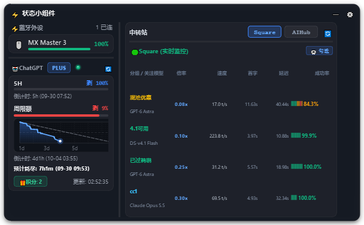
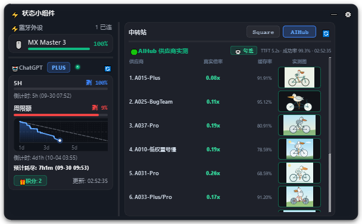
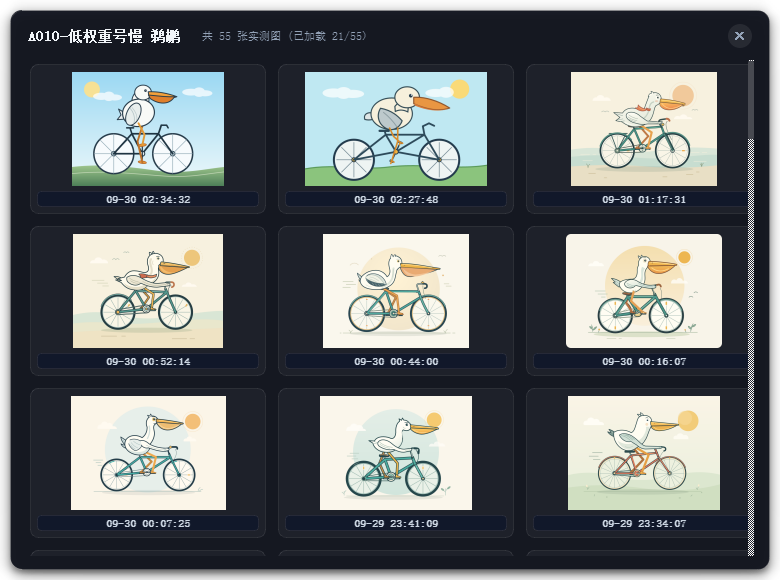
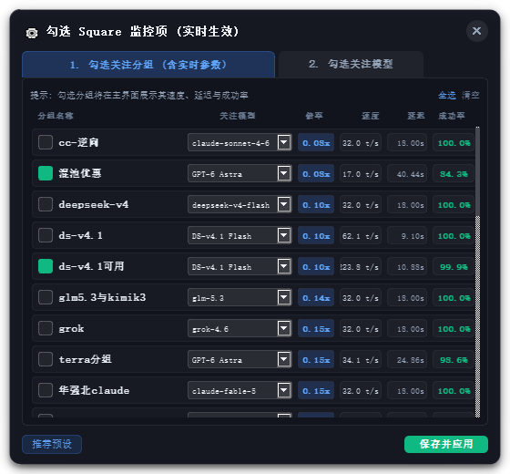
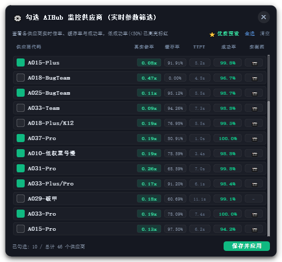

<div align="center">

# ⚡ Codex Usage Floating Widget
### A Vibe-Coding Companion for Windows: Real-Time Bluetooth Battery, ChatGPT/Codex Quotas & AI Relay Benchmarks

[](LICENSE)
[](https://www.python.org/)
[](https://www.microsoft.com/windows)
[](https://riverbankcomputing.com/software/pyqt/)

English | [简体中文](README_zh.md)

<br/>

<p align="center">
  
</p>
<p align="center">
  <em>💊 Mini Capsule Mode (Pinned peripheral battery, dual quota remaining, status light)</em>
</p>

<p align="center">
  
</p>
<p align="center">
  <em>⚡ Expanded Dual-Panel Card (Square API Tab): Left panel for Bluetooth + 7-Day Sparkline rate limit burn, right panel for Square API 24h official model performance benchmarks</em>
</p>

<p align="center">
  
</p>
<p align="center">
  <em>🟢 Expanded Dual-Panel Card (AIHub Tab): Real multiplier, cache hit rate ranking, and embedded live Pelican test thumbnails</em>
</p>

<p align="center">
  
</p>
<p align="center">
  <em>🎨 Online Pelican Verification Gallery: 3-column responsive layout, live dynamic fetch, timestamps, and zero-disk in-memory rendering</em>
</p>

</div>

---

## 💡 Why This Widget? (The Vibe Coding Story)
When pairing wireless microphones such as the **DJI Mic Mini** or **DJI Mic** for **Vibe Coding** (voice-driven programming, AI dictation, and hands-free prompt generation) alongside ChatGPT / OpenAI Codex, developers encounter three core pain points:
1. **Microphone Battery Anxiety**: Mid-thought dictation is abruptly broken when the microphone unexpectedly runs out of power.
2. **Opaque Rate Limits & Burn Rate**: Uncertainty about remaining 5-hour rolling windows and 7-day weekly quotas, lacking a visible pace guide.
3. **Relay Provider Transparency & Model Degradation ("降智")**: Third-party relay stations often obfuscate real rate multipliers, suffer from high TTFT latencies, and risk model downgrading (unverified whether they pass the canonical "Pelican on a Bicycle" SVG benchmark).

**`codex-usage-floating-widget`** solves all these challenges with an elegant, lightweight, dark-acrylic desktop companion.

---

## ✨ Key Features

### 1. 🎙️ Vibe-Coding Peripheral Radar (DJI Mic Mini Priority)
- **Pinned DJI Microphone Priority**:
  - When a **DJI Mic Mini** or **DJI Mic** is connected, its battery is **strictly pinned to the front** of the mini capsule;
  - If no DJI microphone is connected, the widget intelligently falls back to monitoring whichever connected peripheral has the **lowest battery percentage**;
- **Native Hardware Access (< 15ms, 0% CPU)**:
  - Direct calls to Windows `SetupAPI` and `CfgMgr32` via Python `ctypes`, querying standard Bluetooth Battery Service (GATT Profile);
  - Zero background daemon overhead, zero polling lag;
  - Widely supports DJI Mics, mechanical keyboards (NuPhy, Keychron, Lofree Flow), mice (Logitech MX Master/Anywhere), headsets (Sony WH/WF series), and more.

### 2. 🤖 ChatGPT Plus / Codex Quota & State Tracker
- **Zero-Config Token Sync**:
  - Reads `%USERPROFILE%\.codex\auth.json` directly. Stays synchronized with your Codex CLI / ChatGPT Desktop session without manually inputting API tokens;
- **Dual-Quota Capsule Mode**:
  - Compact dot-separated format: `[ 🎙️ 90% | 🤖 16% · 23% 🟢 ]`;
  - Left number is 5-hour rolling limit remaining; right number is weekly quota remaining;
  - Both numbers dynamically and independently shift color based on consumption health (🟢 >50% healthy, 🟠 20%~50% caution, 🔴 <20% critical);
- **7-Day Sparkline Grid & Ideal Burn Baseline**:
  - Structured coordinate frame with 7-day vertical division ticks (`1d`, `3d`, `5d`, `7d`);
  - 10% horizontal fine grid lines with a 50% halfway dashed guideline;
  - **Ideal diagonal pacing guide (100% → 0% across 7 days)** to immediately spot over-consumption;
  - Reordered layout: Reset countdown on top, **bold exhaustion prediction** below (`font-weight: 700`);
  - Exact minute-level timestamps formatted as `倒计时: 3h13m (MM-DD HH:MM)` for both 5H and weekly windows;
- **Turn-Lifecycle Status Indicator (Zero Jitter / No False Flashing)**:
  - Tracks native session event streams (`task_started` → `task_complete` / `turn_aborted`) from `~/.codex/state_5.sqlite` and session rollout logs;
  - Displays a smooth rotating electric amber arc spinner (🟠) while Codex is actively thinking or executing tools;
  - Instantly snaps back to a glowing emerald green dot (🟢) the millisecond the turn completes;
  - Immune to tool-execution latency gaps or CPU sampling noise—completely eliminating the status light "flicker/jitter" problem.

### 3. 🌐 Relay Station Monitoring & Official Pelican Benchmarks
- **CC Switch Official Quota Protection (Dual-Source SQLite Resolver)**:
  - Resolves the issue where switching profiles in CC Switch overwrites `~/.codex/auth.json` and causes official Codex quota to show error ("异常");
  - Features an automatic SQLite fallback parser reading `%USERPROFILE%\.cc-switch\cc-switch.db`: **ChatGPT Plus / Codex quota & countdown tracking remain 100% active regardless of which relay provider is currently active in CC Switch**;
- **Square API Integration (`api.squarefaceicon.org`)**:
  - Crawls and aligns with official Square model plaza detail performance metrics (24h live benchmark);
  - Displays group & focus model, effective multiplier, generation speed (t/s), first-token latency (TTFT), total latency, and reliability bar progress;
  - Interactive modal dialog to toggle monitored groups and customize target focus models (`GPT-6 Astra`, `DS-v4.1 Flash`, `Claude Opus 5.5`, etc.);
- **AIHub Relay & Pelican Test Gallery (`aihub.top`)**:
  - Real-time provider list ranking, actual multiplier conversion, and cache hit rates;
  - **Interactive Provider Selector**: Browse live stats and select candidate providers to monitor;
  - **Pelican Verification Gallery Dialog**:
    - Click any provider's thumbnail to pop up the full historical test gallery;
    - Dynamically streams all past Pelican test images in a responsive 3-column layout with precise generation timestamps;
    - **100% In-Memory QImage decoding**: No temporary junk files created on disk;
    - Powered by an asynchronous daemon thread pool and thread-isolated HTTP sessions, completely immune to GIL deadlocks.

<table align="center">
  <tr>
    <td align="center"><br/><b>Square Focus Groups & Models Selector</b></td>
    <td align="center"><br/><b>AIHub Provider Parameter Filter</b></td>
  </tr>
</table>

### 4. 🪟 Fluid Desktop Interaction
- **Dark Frosted Glassmorphism**: Subtle translucent blur, refined borders, and gentle depth drop-shadows;
- **Side-by-Side Dual-Panel Layout**: Left panel for hardware & official quota, right panel for AI relay providers—rich information density without crowding;
- **Click Anywhere to Expand**: Click any area of the mini capsule to instantly reveal the detailed card;
- **Auto-Collapse on Focus Loss**: Clicking outside anywhere on the desktop automatically folds the widget back into capsule mode;
- **Edge Magnetic Snapping**: Smoothly snaps to screen edges within a 25px threshold;
- **Clean Tray Lifecycle**: Frameless tool window (`Qt.Tool`) hidden from the taskbar; no accidental close buttons—exit cleanly via the system tray context menu.

---

## 🔒 Privacy & Sanitization Notice

- **Fully Sanitized Open-Source**: This repository contains **NO hardcoded personal tokens, API keys, passwords, or emails**;
- **Local Credential Isolation**:
  - All local user configurations reside in `config.json`, which is strictly ignored by `.gitignore` and never committed or uploaded;
  - Refer to `config.example.json` to optionally provide your relay credentials;
- **Read-Only Inspection**:
  - All telemetry lookups are non-mutating, read-only requests. The application never initiates conversational inference requests that deplete your tokens.

---

## 🚀 Getting Started

### 1. Prerequisites
- Windows 10 or Windows 11
- Python 3.8+ (Python 3.10 ~ 3.13 tested and supported)

```bash
git clone https://github.com/Tison6/codex-usage-floating-widget.git
cd codex-usage-floating-widget
pip install -r requirements.txt
```

### 2. Configuration (Optional)
Copy the example config:
```bash
copy config.example.json config.json
```
Edit `config.json` as needed (all fields have sensible defaults and public fallback endpoints).

### 3. Launching
- **Silent Background Launch (No Console Window)**:
  Double-click **`run_silent.vbs`** or **`run.bat`**;
- **Terminal Launch (With Debug Logs)**:
  Double-click **`run_debug.bat`** or execute:
  ```bash
  python main.py
  ```

---

## ⚙️ Quick Actions & Context Menu

Right-click the floating widget or system tray icon:
- **💊 Toggle Mini Capsule / Expanded Card**
- **📏 Scale Size** (Compact 85% / Standard 100% / Large 115%)
- **📌 Always on Top**
- **🔒 Lock Position (Prevent accidental dragging)**
- **🔄 Refresh Now**
- **⚙️ Preferences...** (Intervals, opacity, run at startup)
- **🗕 Hide to Tray / ✕ Exit Application**

---

## 📁 Repository Structure

```
codex-usage-floating-widget/
├── main.py                  # Entry point, single-instance lock & High-DPI scaling
├── config.example.json      # Sanitized default configuration template
├── requirements.txt         # Python package dependencies
├── run_silent.vbs           # Silent background VBS launcher
├── run.bat                  # Batch launcher
├── run_debug.bat            # Debug launcher with output pause
├── LICENSE                  # MIT License
├── README.md                # English Documentation
├── README_zh.md             # Chinese Documentation
├── assets/                  # Screenshot assets
│   ├── capsule-view.png     # Capsule mode preview
│   ├── square-view.png      # Square expanded view
│   ├── aihub-view.png       # AIHub expanded view
│   ├── pelican-viewer.png   # Pelican gallery dialog preview
│   ├── square-filter.png    # Square filter dialog preview
│   └── aihub-filter.png     # AIHub filter dialog preview
├── core/
│   ├── bt_scanner.py        # Windows SetupAPI Bluetooth battery engine
│   ├── codex_client.py      # ChatGPT /wham/usage rate limit parser & CC Switch resolver
│   ├── codex_activity_tracker.py # Turn-lifecycle state monitor (zero jitter)
│   ├── config_manager.py    # Local registry & config management
│   ├── quota_tracker.py     # 7-day quota analytics & burn prediction
│   ├── square_client.py     # Square API official 24h performance crawler
│   └── aihub_client.py      # AIHub public provider & benchmark client
└── ui/
    ├── floating_widget.py   # Main frameless widget (dual-panel, auto-collapse, snap)
    ├── battery_view.py      # Bluetooth peripheral list view
    ├── codex_view.py        # AI quota card & countdown view
    ├── sparkline_widget.py  # 7-day coordinate grid & baseline chart
    ├── status_light.py      # Dual-state glowing & rotating light
    ├── relay_view.py        # Tabbed relay station view with thumbnail manager
    ├── square_filter_dialog.py # Interactive filter modals for Square & AIHub
    ├── pelican_viewer.py    # Pelican gallery dialog & async download manager
    ├── settings_dialog.py   # Preference settings modal
    ├── tray_manager.py      # Windows system tray integration
    └── styles.py            # QSS dark glassmorphism stylesheet
```

---

## ❓ FAQ

<details>
<summary><b>Q1: ChatGPT quota shows "Unauthorized" or failed to fetch?</b></summary>
<br/>
This widget reads your existing authorization credentials from <code>%USERPROFILE%\.codex\auth.json</code>. Ensure that you have installed the official Codex CLI or ChatGPT desktop application and logged in at least once so this file exists. If you switched profiles via CC Switch, the widget will automatically restore official credentials from <code>%USERPROFILE%\.cc-switch\cc-switch.db</code>.
</details>

<details>
<summary><b>Q2: Bluetooth peripheral connected but battery is not showing?</b></summary>
<br/>
Windows natively supports battery queries for devices providing the standard Bluetooth Battery Service (GATT Profile). Devices connected strictly via proprietary 2.4GHz USB wireless dongles do not expose battery telemetry to Windows OS APIs.
</details>

<details>
<summary><b>Q3: Does browsing Pelican test images write junk files to my disk?</b></summary>
<br/>
No. All full-size Pelican images and provider thumbnails are decoded in memory using dedicated worker threads. They are held in transient memory caches and cleanly discarded without generating disk clutter.
</details>

<details>
<summary><b>Q4: How to exit or move the widget?</b></summary>
<br/>
- <b>Move</b>: Left-click and drag anywhere on the widget to reposition. It will auto-snap when near the screen border.<br/>
- <b>Exit</b>: Right-click the system tray icon (or the widget itself) and select "✕ 退出程序" (Exit).
</details>

---

## 📄 License

This project is licensed under the [MIT License](LICENSE).
