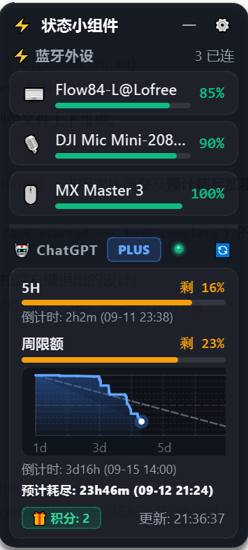

<div align="center">

# ⚡ Codex Usage Floating Widget
### 专为语音编程（Vibe Coding）打造的 Windows 桌面悬浮雷达：外设电量与 ChatGPT/Codex 配额监控

[](LICENSE)
[](https://www.python.org/)
[](https://www.microsoft.com/windows)
[](https://riverbankcomputing.com/software/pyqt/)

[English](README.md) | 简体中文

<br/>

<p align="center">
  
</p>
<p align="center">
  <em>迷你胶囊模式（点击任意区域秒级展开）</em>
</p>

<p align="center">
  
</p>
<p align="center">
  <em>展开卡片视图：外设电量列表 + 7天限额消耗基准曲线 + 倒计时与耗尽预警</em>
</p>

</div>

---

## 💡 为什么需要它？(The Vibe Coding Story)
在使用 **大疆麦克风（DJI Mic Mini / DJI Mic）** 进行 **语音编程（Vibe Coding）**、灵感口述或高强度与 ChatGPT / OpenAI Codex 协同编写代码时，开发者最常遇到的两个痛点：
1. **麦克风电量焦虑**：全神贯注编程时，麦克风突然没电断联，打断心流与口述进程；
2. **AI 限额盲盒**：不知道 5 小时滚动限额或周限额何时耗尽，缺少平稳的消耗节奏指引。

**`codex-usage-floating-widget`** 正是为此而生的一款轻量、优雅、暗黑毛玻璃质感的 Windows 桌面小组件。

---

## ✨ 核心亮点

### 1. 🎙️ 为 Vibe Coding 打造的外设电量雷达
- **大疆麦克风专属置顶（DJI Mic Mini Priority）**：
  - 检测到 DJI Mic Mini / DJI Mic 连接时，**自动固定置顶在胶囊最前端**，电量随时在视线边缘一览无余；
  - 若未连接麦克风，则智能回退为**展示当前所有在线外设中电量最低的设备**；
- **底层硬件直连，零资源消耗（< 15ms, 0% CPU）**：
  - 基于 Python 原生 `ctypes` 调用 Windows `SetupAPI` 与 `CfgMgr32` 读取硬件电量属性，单次扫描耗时 `< 15ms`，空闲时 CPU 占用稳定为 `0%`；
  - 广泛支持 DJI Mic 系列、机械键盘（NuPhy、Keychron、Lofree Flow）、无线鼠标（罗技 MX Master / Anywhere 系列）、索尼降噪耳机等。

### 2. 🤖 ChatGPT Plus / Codex 额度与状态监测
- **零配置凭据同步**：
  - 自动读取本地 `%USERPROFILE%\.codex\auth.json` 鉴权凭证，与 Codex CLI / ChatGPT 桌面端无缝联动，免除手动输入 Token；
- **纯净双显胶囊（Dual-Quota Capsule）**：
  - 胶囊模式以最精炼的点分数字格式呈现：`[ 🎙️ 90% | 🤖 16% · 23% 🟢 ]`；
  - 左侧为 5 小时滚动限额剩余，右侧为周限额剩余，两个数字**独立根据健康度动态变色**（🟢 充足 / 🟠 适中 / 🔴 预警）；
- **7天消耗速率坐标折线图（Sparkline Grid）与耗尽预测**：
  - 规范的坐标边框与 X 轴 7 等分天数网格（`1d` / `3d` / `5d` / `7d`）；
  - Y 轴每 10% 水平细线与 50% 半程基准虚线；
  - **副对角线理想匀速消耗基准（100% 降至 0%）**，直观对比当前实际消耗是否超速；
  - 倒计时置于上方，**预计耗尽时间置于下方并加粗突出**（`font-weight: 700`）；
  - 5H 滚动窗口与周限额均支持精确到分钟与具体日期的倒计时显示：`倒计时: 3h13m (MM-DD HH:MM)`；
- **原生轮次生命周期状态追踪（彻底告别指示灯反复横跳）**：
  - 基于会话运行记录的**原生轮次生命周期（Turn Lifecycle: `task_started` → `task_complete` / `turn_aborted`）**状态机；
  - 遇到耗时工具调用或长推理时，指示灯**稳定保持橙色旋转（🟠 运行中）**；
  - 一旦 Codex 完成回答并写入 `task_complete`，瞬间切回**稳定翡翠绿呼吸光（🟢 就绪）**；
  - 配套内存级 `(mtime, size)` 差值缓存，100% 免疫 CPU 采样噪点与工具延迟波动，日常检测零磁盘消耗。

### 3. 🪟 自然沉浸的桌面交互美学
- **暗黑毛玻璃质感**：高透半透明卡片、微光边框与动态深度阴影；
- **点窗即开**：点击迷你胶囊任意位置即可瞬间展开完整卡片；
- **失焦自动折叠**：点击桌面其他任意窗口，卡片自动收起为迷你胶囊；
- **边缘智能吸附**：鼠标拖拽至屏幕边缘 25px 范围内自动磁吸贴边；
- **任务栏免打扰**：采用 `Qt.Tool` 属性，不占用 Windows 任务栏位置，不干扰 `Alt+Tab`；
- **纯粹关闭交互**：卡片内无误触叉号，日常安静常驻，退出统一在系统托盘右键完成。

---

## 🚀 快速使用

### 1. 环境准备
确保您的电脑安装了 Python 3.8+（支持 Python 3.10 ~ 3.13）：

```bash
git clone https://github.com/Tison6/codex-usage-floating-widget.git
cd codex-usage-floating-widget
pip install -r requirements.txt
```

### 2. 运行启动
- **日常便捷启动（静默无黑框）**：
  双击运行 **`run_silent.vbs`** 或 **`run.bat`**；
- **终端启动（查看调试日志）**：
  双击 **`run_debug.bat`** 或运行命令：
  ```bash
  python main.py
  ```

---

## ⚙️ 快捷操作与右键菜单

在小组件或系统托盘图标上点击**鼠标右键**：
- **💊 切换迷你胶囊 / 展开面板**
- **📏 窗口缩放尺寸**（紧凑 85% / 标准 100% / 放大 115%）
- **📌 窗口置顶（Always on Top）**
- **🔒 锁定窗口位置（防止误触移动）**
- **🔄 立即刷新用量与外设数据**
- **⚙️ 偏好设置...**（调整刷新频率、透明度、开机自启）
- **🗕 隐藏到托盘 / ✕ 退出程序**

---

## 📁 项目架构

```
codex-usage-floating-widget/
├── main.py                  # 应用入口与 High-DPI 缩放适配
├── config.example.json      # 默认配置模板
├── requirements.txt         # Python 依赖清单
├── run_silent.vbs           # 静默后台启动脚本（无黑色控制台窗口）
├── run.bat                  # 便携式批处理启动入口
├── run_debug.bat            # 调试启动入口（遇错暂停输出）
├── LICENSE                  # MIT 开源许可证
├── README.md                # 英文说明文档
├── README_zh.md             # 中文说明文档
├── assets/                  # 截图预览资源
│   ├── capsule-view.png
│   └── expanded-view.png
├── core/
│   ├── bt_scanner.py        # Windows SetupAPI 蓝牙电量扫描引擎
│   ├── codex_client.py      # ChatGPT /wham/usage 配额解析器
│   ├── codex_activity_tracker.py # 原生轮次生命周期监控（无横跳指示灯）
│   ├── config_manager.py    # 本地配置注册与管理
│   └── quota_tracker.py     # 7天配额消耗分析与耗尽预测
└── ui/
    ├── floating_widget.py   # 无边框悬浮主窗体（磁吸贴边、失焦自动收起）
    ├── battery_view.py      # 蓝牙外设列表展示组件
    ├── codex_view.py        # AI 配额卡片与倒计时视图
    ├── sparkline_widget.py  # 7天坐标网格与理想基准折线图
    ├── status_light.py      # 双状态呼吸绿点与活力橙旋转指示灯
    ├── settings_dialog.py   # 偏好设置弹窗
    ├── tray_manager.py      # Windows 系统托盘管理
    └── styles.py            # QSS 暗黑毛玻璃样式表
```

---

## ❓ 常见问题排查（FAQ）

<details>
<summary><b>Q1: ChatGPT 额度提示“未认证”或获取失败？</b></summary>
<br/>
本项目通过读取本地 OpenAI Codex CLI 或桌面客户端的本地认证文件获取额度数据。请确保已在终端运行过 <code>codex</code> 命令并完成登录，或检查 <code>%USERPROFILE%\.codex\auth.json</code> 文件是否存在。
</details>

<details>
<summary><b>Q2: 蓝牙设备已连接但没有显示电量？</b></summary>
<br/>
Windows 原生仅支持具备“电池服务（Battery Service GATT Profile）”或上报标准 PnP 电池属性的蓝牙设备。部分使用专有 2.4GHz 接收器（非标准蓝牙模式）的键鼠可能不向 Windows 系统上报电池指标。
</details>

<details>
<summary><b>Q3: 如何移动窗口或退出程序？</b></summary>
<br/>
- <b>移动</b>：鼠标左键按住窗口任意空白区域拖拽即可，移至屏幕边缘时会自动磁吸吸附。
<br/>
- <b>退出</b>：在系统托盘图标或窗口上点击鼠标右键，选择“✕ 退出程序”即可完全退出。
</details>

---

## 📄 开源协议

本项目采用 [MIT License](LICENSE) 开源协议。
